# Go Browser Engine — Architecture

This document describes the complete internal architecture of the Go Browser Engine, tracing the full data flow from a URL entered by the user all the way to pixels rendered on screen.

---

## Table of Contents

1. [High-Level Pipeline](#1-high-level-pipeline)
2. [Package Dependency Graph](#2-package-dependency-graph)
3. [Stage 1 — Network: Fetching HTML](#3-stage-1--network-fetching-html)
4. [Stage 2 — Parser: Building the DOM](#4-stage-2--parser-building-the-dom)
5. [Stage 3 — DOM: Node Model](#5-stage-3--dom-node-model)
6. [Stage 4 — JavaScript Execution](#6-stage-4--javascript-execution)
7. [Stage 5 — CSS: Parsing Stylesheets](#7-stage-5--css-parsing-stylesheets)
8. [Stage 6 — Style: Computing Styles](#8-stage-6--style-computing-styles)
9. [Stage 7 — Layout: Box Model](#9-stage-7--layout-box-model)
10. [Stage 8 — Paint: Rendering to Screen](#10-stage-8--paint-rendering-to-screen)
11. [User Interaction Loop](#11-user-interaction-loop)
12. [Data Structures Cheat Sheet](#12-data-structures-cheat-sheet)

---

## 1. High-Level Pipeline

The browser engine is a sequential pipeline. Each stage transforms its input into a richer representation that the next stage consumes.

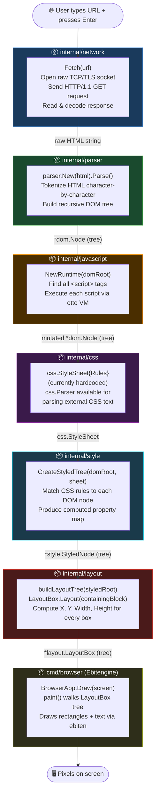

---

## 2. Package Dependency Graph

Shows which packages import which. The dependency flow is strictly top-down — no circular imports.

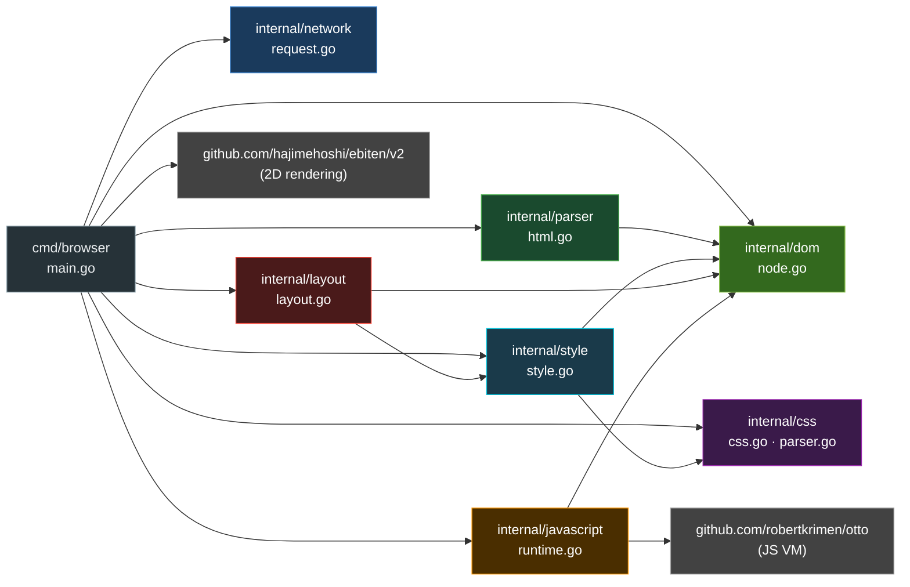

---

## 3. Stage 1 — Network: Fetching HTML

**Package:** `internal/network` · **File:** `request.go`  
**Entry point:** `Fetch(url string) (string, error)`

The engine does **not** use Go's standard `net/http` package. Instead it opens a raw socket connection and manually constructs an HTTP/1.1 request.

### Flow

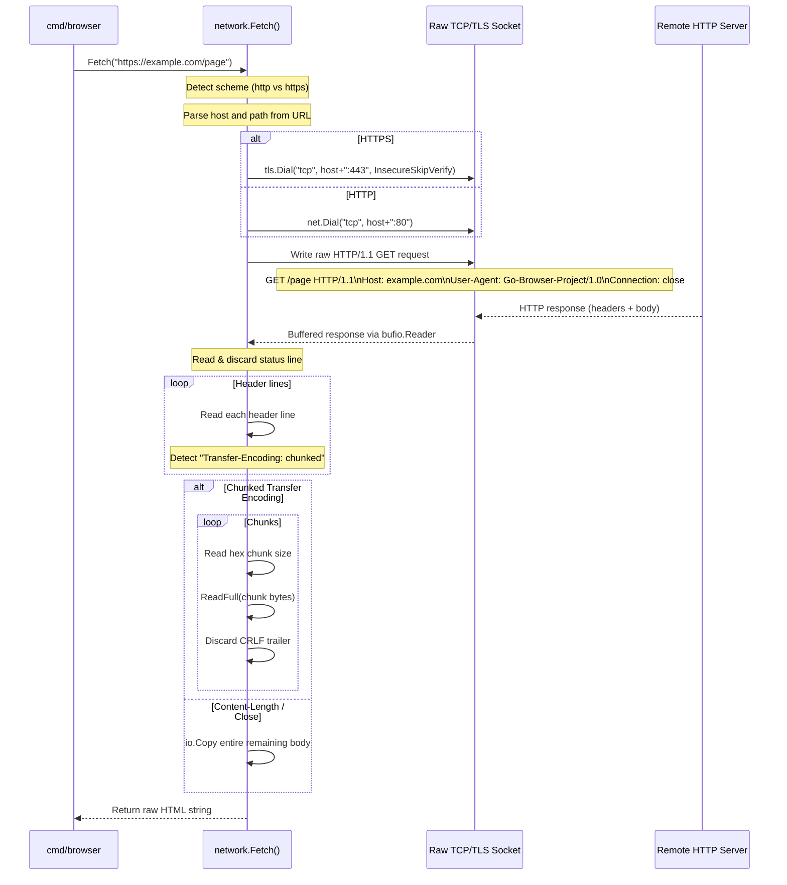

### Key implementation details

| Detail | Implementation |
|---|---|
| Protocol detection | `strings.HasPrefix(url, "https://")` |
| TLS | `tls.Dial` with `InsecureSkipVerify: true` |
| HTTP version | HTTP/1.1 only |
| Header parsing | Line-by-line with `bufio.Reader.ReadString('\n')` |
| Chunked decoding | Manual hex-size → `io.ReadFull` loop |
| Body (non-chunked) | Single `io.Copy` into a `strings.Builder` |

---

## 4. Stage 2 — Parser: Building the DOM

**Package:** `internal/parser` · **File:** `html.go`  
**Entry point:** `New(html).Parse() *dom.Node`

The HTML parser is a hand-written **recursive descent** parser. It consumes the raw HTML string one character at a time and constructs a tree of `dom.Node` objects.

### Parsing State Machine

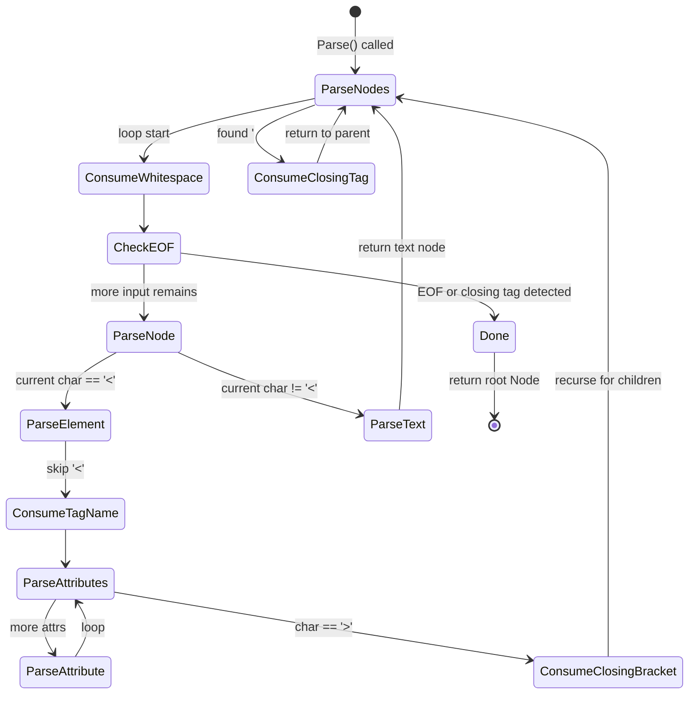

### Call Stack (Recursive Descent)

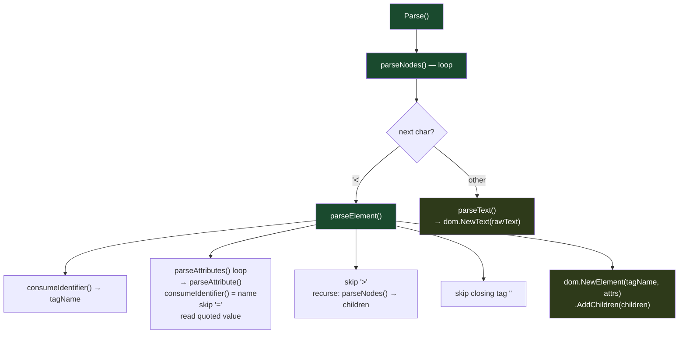

### Example transformation

```
Input HTML:
  <h1 class="title">Hello</h1>

Parsed DOM:
  Node{Type: ElementNode, TagName: "h1", Attr: {"class": "title"}}
    └── Node{Type: TextNode, Text: "Hello"}
```

> **Note:** The parser does not handle self-closing tags (e.g., `<br/>`, ``), `DOCTYPE`, HTML comments, or malformed markup. It is intentionally minimal.

---

## 5. Stage 3 — DOM: Node Model

**Package:** `internal/dom` · **File:** `node.go`

The DOM is the shared data structure that flows through every subsequent stage. It is a simple recursive tree.

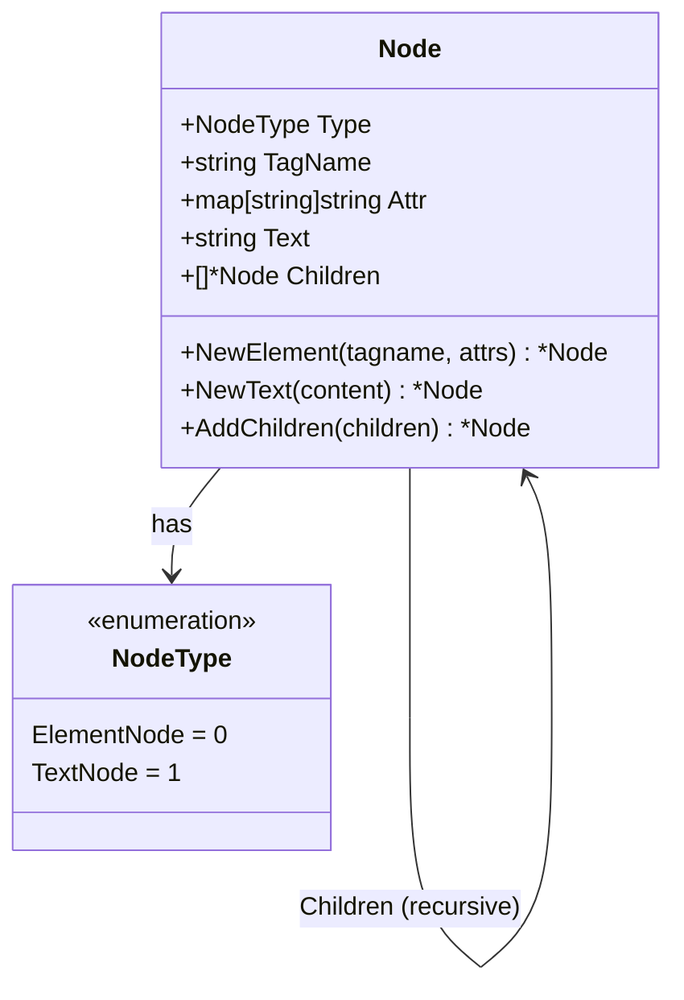

**ElementNode** carries `TagName` (e.g., `"div"`, `"a"`) and `Attr` (e.g., `{"href": "/page"}`).  
**TextNode** carries only `Text` — the raw string content between tags.

---

## 6. Stage 4 — JavaScript Execution

**Package:** `internal/javascript` · **File:** `runtime.go`  
**Entry point:** `NewRuntime(root *dom.Node) *JSRuntime`

JavaScript runs **before** CSS styling and layout, allowing scripts to mutate the DOM tree first.

```mermaid
sequenceDiagram
    participant Nav as navigate()
    participant Find as findScripts()
    participant JSR as javascript.NewRuntime()
    participant Otto as otto.Otto VM

    Nav->>Find: Walk DOM tree for &lt;script&gt; nodes
    Note over Find: Collect Children[0].Text from every\nnode where TagName == "script"
    Find-->>Nav: []string of script source code

    Nav->>JSR: NewRuntime(domRoot)
    Note over JSR: Creates otto.Otto VM
    JSR->>Otto: vm.Set("console", {log: fn})
    Note over Otto: console.log → fmt.Printf to stdout
    JSR->>Otto: vm.Set("document", {title: "Go Browser Engine"})
    JSR-->>Nav: *JSRuntime

    loop For each script string
        Nav->>JSR: Execute(scriptSource)
        JSR->>Otto: vm.Run(scriptSource)
        Otto-->>JSR: (result, error)
        JSR-->>Nav: error (logged if non-nil)
    end
```

### JS API surface (current)

| JS global | Go binding | Behaviour |
|---|---|---|
| `console.log(msg)` | `fmt.Printf` | Prints to stdout |
| `document.title` | Static string | Always `"Go Browser Engine"` |

> Full `document.getElementById`, `innerHTML` mutations, and event listeners are **not yet implemented**.

---

## 7. Stage 5 — CSS: Parsing Stylesheets

**Package:** `internal/css` · **Files:** `css.go`, `parser.go`

### Data Model

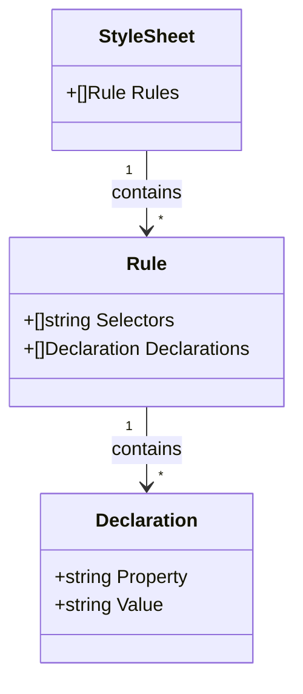

### CSS Parser FSM

```mermaid
stateDiagram-v2
    [*] --> ParseSheet
    ParseSheet --> ConsumeWS
    ConsumeWS --> CheckEOF2
    CheckEOF2 --> Done2 : EOF
    CheckEOF2 --> ParseRule : more input

    ParseRule --> ParseSelectors
    ParseSelectors --> ReadSelector : consumeIdentifier()
    ReadSelector --> CheckComma
    CheckComma --> ReadSelector : ',' found (another selector)
    CheckComma --> ParseDeclarations : '{' found

    ParseDeclarations --> ReadDeclaration
    ReadDeclaration --> ReadProp : consumeIdentifier()
    ReadProp --> SkipColon
    SkipColon --> ReadValue : scan until ';' or '}'
    ReadValue --> ReadDeclaration : ';' found, loop
    ReadDeclaration --> ParseSheet : '}' found, rule done

    Done2 --> [*]
```

### Example

```css
/* Input CSS string */
h1, h2 { color: red; font-size: 24px; }

/* Resulting StyleSheet */
StyleSheet{
  Rules: [
    Rule{
      Selectors:    ["h1", "h2"],
      Declarations: [
        {Property: "color",     Value: "red"},
        {Property: "font-size", Value: "24px"},
      ],
    },
  ],
}
```

> **Current usage:** The `css.Parser` is available but the `navigate()` function currently defines the stylesheet **inline** in Go code (hardcoded `h1 { color: red }`). Parsing external `<link>` stylesheets or `<style>` blocks is not yet wired up.

---

## 8. Stage 6 — Style: Computing Styles

**Package:** `internal/style` · **File:** `style.go`  
**Entry point:** `CreateStyledTree(root *dom.Node, sheet css.StyleSheet) *StyledNode`

This stage **marries** the DOM tree with the CSS stylesheet, producing a mirror tree where every node carries its computed CSS properties.

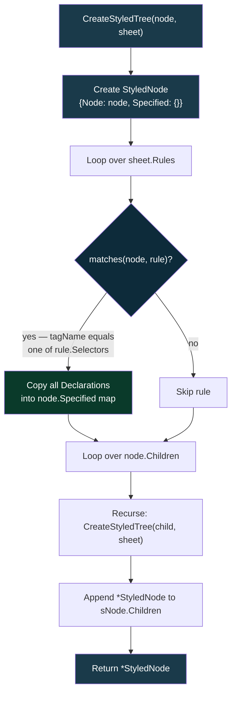

### Data Model

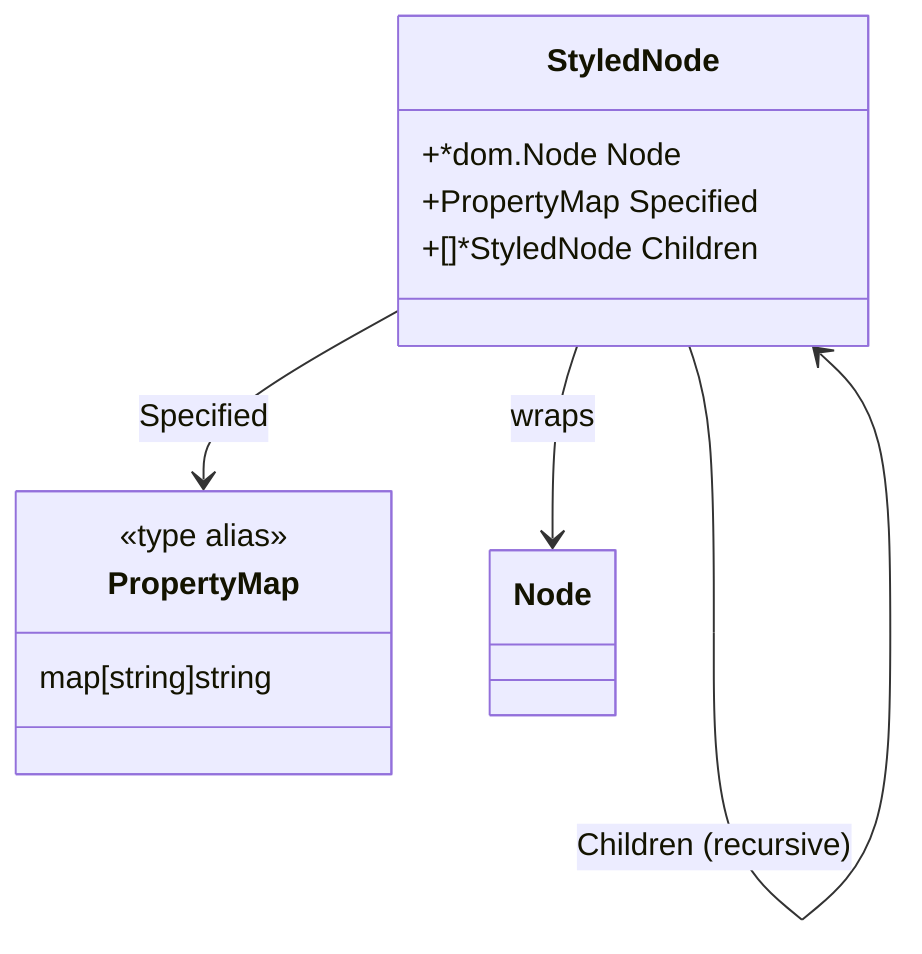

**Selector matching** is currently tag-name only — `node.TagName == selector`. Class, ID, attribute, and pseudo selectors are not yet implemented.

---

## 9. Stage 7 — Layout: Box Model

**Package:** `internal/layout` · **File:** `layout.go`  
**Entry point:** `LayoutBox.Layout(containingBlock Rect)`

Layout converts the styled tree into a **positioned box tree**. Every box gets concrete `X`, `Y`, `Width`, `Height` float32 values.

### Algorithm

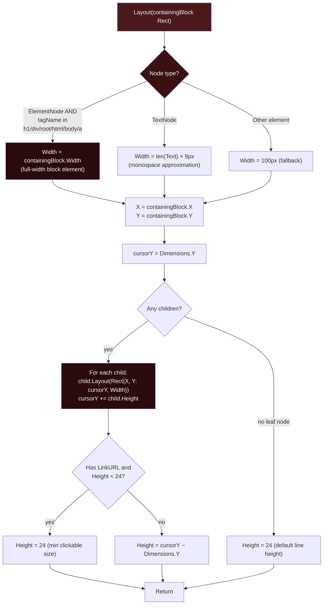

### Data Model

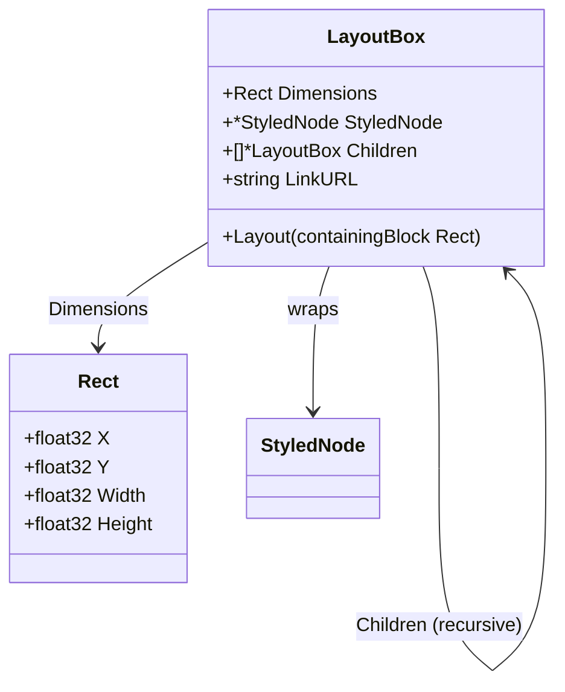

**Link propagation:** When `buildLayoutTree` encounters an `<a>` element, it stores the `href` attribute in `LinkURL`. This value is propagated down to all descendant boxes so hit-testing can find the URL anywhere within the link's subtree.

---

## 10. Stage 8 — Paint: Rendering to Screen

**Package:** `cmd/browser` · handled inside `BrowserApp.Draw()` and `BrowserApp.paint()`

The final stage walks the `LayoutBox` tree and issues draw calls to Ebitengine.

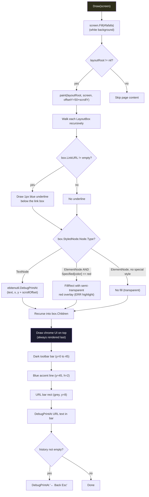

### Paint colour logic

| Condition | Visual output |
|---|---|
| `TextNode` | Plain text drawn with `ebitenutil.DebugPrintAt` |
| `ElementNode` + `color: red` style | Semi-transparent red `FillRect` highlight |
| Box has `LinkURL` | 1 px blue underline drawn at bottom of box |
| Toolbar | Dark grey rect + blue accent bar |
| URL input | Darker grey rect with typed URL text |

---

## 11. User Interaction Loop

`BrowserApp.Update()` is called every frame by Ebitengine (~60 FPS). It handles all user input.

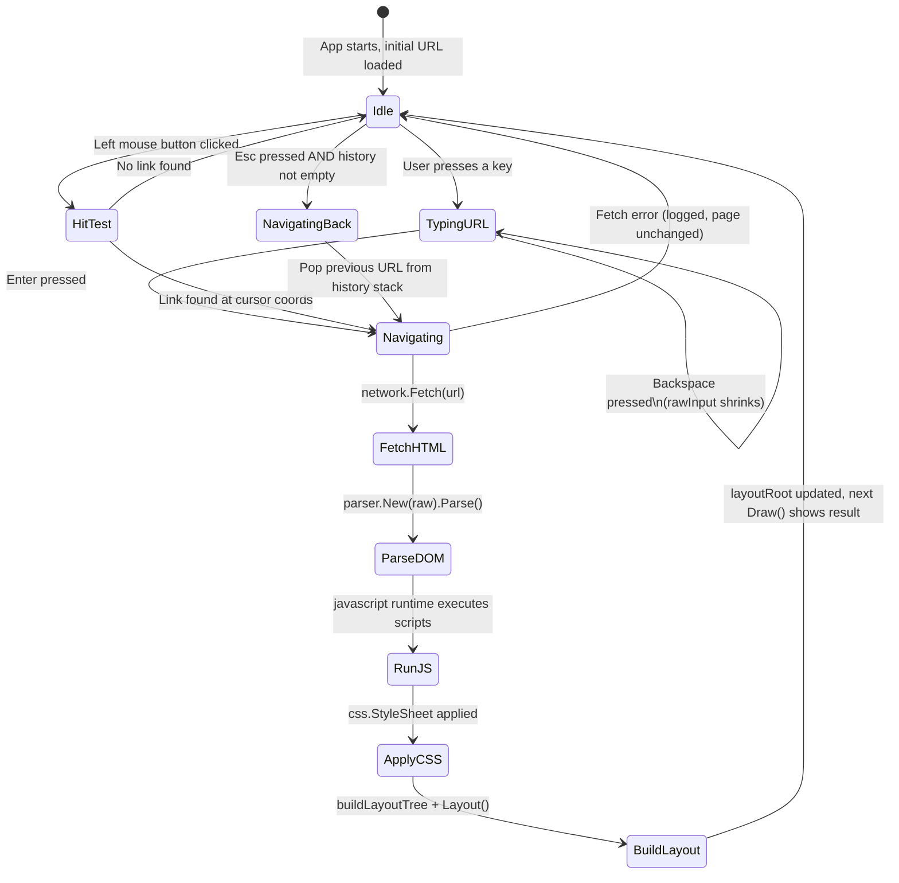

### URL Resolution

When a link is clicked, `resolveURL(currentURL, target)` determines the absolute URL to navigate to:

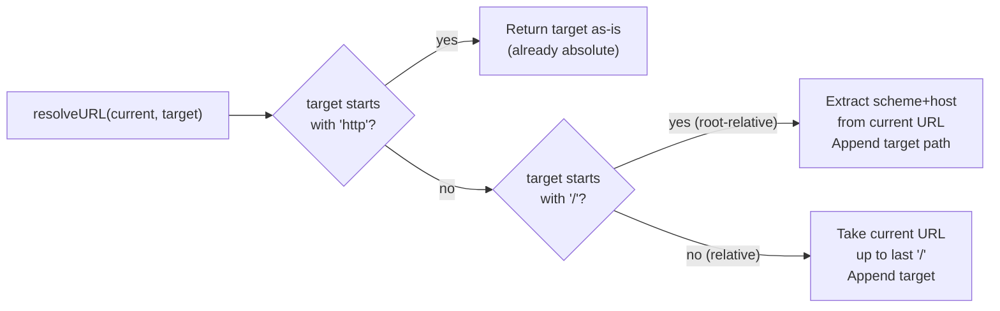

---

## 12. Data Structures Cheat Sheet

This shows how data transforms at each stage boundary:

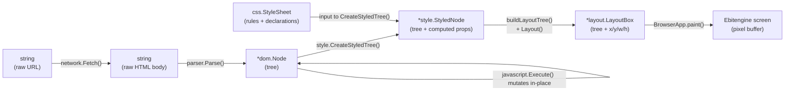

---

*This document reflects the current state of the codebase as of March 2026. As new features are added (redirect handling, CSS class/ID selectors, full DOM API, etc.), this document should be updated accordingly.*
