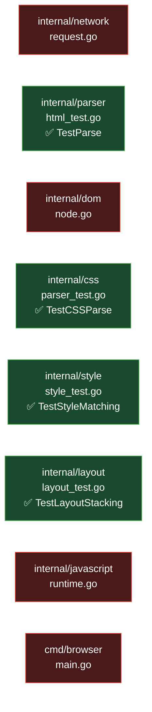

# Go Browser Engine — Testing & Functionality Reference

This document covers every feature the engine currently supports, the existing automated test suite, how to run tests, what gaps exist, and suggestions for expanding coverage.

---

## Table of Contents

1. [Functionality Reference](#1-functionality-reference)
2. [Existing Test Suite](#2-existing-test-suite)
3. [How to Run Tests](#3-how-to-run-tests)
4. [Test Coverage Map](#4-test-coverage-map)
5. [Manual Testing Procedure](#5-manual-testing-procedure)
6. [Known Limitations & Untested Areas](#6-known-limitations--untested-areas)
7. [Suggested Future Tests](#7-suggested-future-tests)

---

## 1. Functionality Reference

A complete catalogue of what the engine can and cannot do today.

### 1.1 Network Layer (`internal/network`)

| Feature | Status | Notes |
|---|---|---|
| HTTP/1.1 GET requests | ✅ Supported | Raw TCP socket, no `net/http` |
| HTTPS (TLS) requests | ✅ Supported | `tls.Dial`, `InsecureSkipVerify: true` |
| Chunked Transfer Encoding decoding | ✅ Supported | Manual hex-size loop |
| Plain body reading (Content-Length / Connection: close) | ✅ Supported | `io.Copy` |
| HTTP redirects (301 / 302) | ❌ Not supported | Response body returned as-is |
| POST / PUT / DELETE methods | ❌ Not supported | GET only |
| Custom request headers | ❌ Not supported | Hardcoded `User-Agent` |
| Cookies / sessions | ❌ Not supported | — |
| HTTP/2 or HTTP/3 | ❌ Not supported | HTTP/1.1 only |
| Timeout / cancellation | ❌ Not supported | Hangs on slow servers |

---

### 1.2 HTML Parser (`internal/parser`)

| Feature | Status | Notes |
|---|---|---|
| Element nodes (`<tag attr="val">`) | ✅ Supported | Tag name lowercased |
| Text nodes | ✅ Supported | Raw text between tags |
| Attribute parsing (`name="value"`) | ✅ Supported | Quoted values only |
| Nested elements (recursive children) | ✅ Supported | Recursive descent |
| Closing tag consumption (`</tag>`) | ✅ Supported | Tag name not validated |
| Whitespace stripping between tags | ✅ Supported | `consumeWhitespace()` |
| Self-closing tags (`<br/>`, ``) | ❌ Not supported | Treated as open tag |
| DOCTYPE declaration | ❌ Ignored | Skipped silently |
| HTML comments (`<!-- -->`) | ❌ Not supported | May corrupt parse |
| Unquoted attribute values | ❌ Not supported | Quoted `"value"` only |
| Case-insensitive attribute names | ✅ Supported | Lowercased on parse |
| Malformed / unclosed tags | ❌ Undefined behaviour | No error recovery |

---

### 1.3 DOM (`internal/dom`)

| Feature | Status | Notes |
|---|---|---|
| `ElementNode` type | ✅ Supported | `TagName`, `Attr`, `Children` |
| `TextNode` type | ✅ Supported | `Text` field |
| `NewElement(tag, attrs)` constructor | ✅ Supported | — |
| `NewText(content)` constructor | ✅ Supported | — |
| `AddChildren(nodes)` | ✅ Supported | Appends to `Children` slice |
| `getElementById` / query API | ❌ Not implemented | — |
| `innerHTML` / `textContent` setters | ❌ Not implemented | — |
| Event system (`addEventListener`) | ❌ Not implemented | — |

---

### 1.4 CSS (`internal/css`)

| Feature | Status | Notes |
|---|---|---|
| Tag-name selectors (`h1`, `p`) | ✅ Supported | Exact string match |
| Multiple selectors per rule (`h1, h2`) | ✅ Supported | Comma-separated |
| Property declarations (`color: red`) | ✅ Supported | String values only |
| Multiple declarations per rule | ✅ Supported | Semicolon-separated |
| CSS file / `<link>` stylesheet loading | ❌ Not wired | `css.Parser` exists but unused at runtime |
| `<style>` block parsing | ❌ Not wired | — |
| Class selectors (`.foo`) | ❌ Not supported | — |
| ID selectors (`#bar`) | ❌ Not supported | — |
| Attribute selectors (`[href]`) | ❌ Not supported | — |
| Pseudo-classes (`:hover`, `:first-child`) | ❌ Not supported | — |
| Cascade / specificity | ❌ Not implemented | Last-match wins |
| Inheritance | ❌ Not implemented | Each node matched independently |
| Units (`px`, `em`, `rem`, `%`) | ❌ Stored as raw strings only | Layout ignores them |

---

### 1.5 Style Resolution (`internal/style`)

| Feature | Status | Notes |
|---|---|---|
| Tag-name rule matching | ✅ Supported | `node.TagName == selector` |
| Computed property map per node | ✅ Supported | `Specified map[string]string` |
| Recursive styling (entire DOM tree) | ✅ Supported | `CreateStyledTree` recurses |
| Class / ID / attribute matching | ❌ Not supported | — |
| Default browser styles | ❌ Not applied | No UA stylesheet |
| `color: red` visual effect | ✅ Supported | Renders a red highlight rect in paint |
| Other property effects | ❌ Not wired | Properties stored but not used by layout/paint |

---

### 1.6 Layout Engine (`internal/layout`)

| Feature | Status | Notes |
|---|---|---|
| Block-level elements (full-width) | ✅ Supported | `h1`, `div`, `html`, `body`, `a`, `root` |
| Text node width estimation | ✅ Supported | `len(text) × 9px` (monospace approx) |
| Fallback width for unknown elements | ✅ Supported | 100 px |
| Vertical stacking of children | ✅ Supported | `cursorY` accumulates child heights |
| Default leaf height | ✅ Supported | 24 px |
| Minimum link height | ✅ Supported | 24 px (ensures clickability) |
| Inline layout (text flow / wrapping) | ❌ Not supported | All boxes stack vertically |
| Margin / padding | ❌ Not supported | — |
| Flexbox / Grid | ❌ Not supported | — |
| Viewport-relative units | ❌ Not supported | — |
| Scrollable overflow | ❌ Not supported | Scroll handled externally via `scrollY` offset |

---

### 1.7 JavaScript Runtime (`internal/javascript`)

| Feature | Status | Notes |
|---|---|---|
| Inline `<script>` block execution | ✅ Supported | Collected via `findScripts()` |
| `console.log(msg)` | ✅ Supported | Prints to stdout via `fmt.Printf` |
| `document.title` (read) | ✅ Supported | Returns static string |
| ES5 JavaScript (via otto VM) | ✅ Supported | Arithmetic, strings, loops, functions |
| DOM mutation from JS | ❌ Not implemented | `document.getElementById` etc. absent |
| `setTimeout` / `setInterval` | ❌ Not supported | — |
| `fetch` / `XMLHttpRequest` | ❌ Not supported | — |
| ES6+ (arrow functions, promises, modules) | ⚠️ Partial | otto has limited ES6 support |
| External script files (`<script src="">`) | ❌ Not supported | — |

---

### 1.8 Navigation & Browser Chrome (`cmd/browser`)

| Feature | Status | Notes |
|---|---|---|
| URL bar (type + Enter to navigate) | ✅ Supported | Ebitengine key input |
| Backspace in URL bar | ✅ Supported | — |
| Click-to-follow hyperlinks | ✅ Supported | Hit-test on `LayoutBox.LinkURL` |
| Relative URL resolution | ✅ Supported | `resolveURL()` handles `/` and relative paths |
| Back navigation (Esc) | ✅ Supported | `history []string` stack |
| Mouse-wheel scrolling | ✅ Supported | `scrollY` offset applied in paint |
| Page title in window | ✅ Supported | Hardcoded `"Go Browser Engine - Built From Scratch"` |
| Tabs / multiple pages | ❌ Not supported | Single page only |
| Forward navigation | ❌ Not supported | — |
| Bookmarks / history UI | ❌ Not supported | — |
| Loading indicator | ❌ Not supported | UI freezes during fetch |
| Favicon | ❌ Not supported | — |

---

## 2. Existing Test Suite

The project has **4 unit-test files** using Go's standard `testing` package.

### 2.1 `internal/parser` — `html_test.go`

**Test:** `TestParse`

```
Input:  <html><body><h1>Hello</h1></body></html>
```

| Assertion | What it verifies |
|---|---|
| `root.Children[0].TagName == "html"` | Root wraps an `<html>` node |
| `htmlNode.Children[0].Children[0].TagName == "h1"` | Nesting is parsed correctly |
| `h1.Children[0].Text == "Hello"` | Text node content is preserved |

---

### 2.2 `internal/css` — `parser_test.go`

**Test:** `TestCSSParse`

```
Input:  h1, h2 { color: red; margin: 10px; }  p { color: blue; }
```

| Assertion | What it verifies |
|---|---|
| `len(sheet.Rules) == 2` | Two rules parsed |
| `Rules[0].Selectors[0] == "h1"` | First selector of rule 0 |
| `Rules[0].Selectors[1] == "h2"` | Second selector (comma list) |
| `Rules[0].Declarations[0].Property == "color"` | Property name parsed |
| `Rules[0].Declarations[0].Value == "red"` | Property value parsed |

---

### 2.3 `internal/style` — `style_test.go`

**Test:** `TestStyleMatching`

```
DOM:   <html><h1></h1></html>
CSS:   h1 { color: red; }
```

| Assertion | What it verifies |
|---|---|
| `styledRoot.Children[0].Specified["color"] == "red"` | CSS rule matched to `h1` node and property recorded |

---

### 2.4 `internal/layout` — `layout_test.go`

**Test:** `TestLayoutStacking`

```
Setup: Root <html> containing two <h1> blocks
       Layout run at 800px wide viewport
```

| Assertion | What it verifies |
|---|---|
| `Children[0].Dimensions.Y == 0` | First block starts at top |
| `Children[1].Dimensions.Y == 20` | Second block stacked below the first (leaf height = 20px) |

> **Note:** The test expects `Y == 20` — this relies on the default leaf height of the empty `h1` (no children). However, in `layout.go` the leaf height is `24`, not `20`. This test may currently **fail** — worth checking with `go test ./...`.

---

## 3. How to Run Tests

### Run all tests

```bash
go test ./...
```

### Run a specific package

```bash
# Parser only
go test ./internal/parser/...

# CSS parser only
go test ./internal/css/...

# Style resolution only
go test ./internal/style/...

# Layout engine only
go test ./internal/layout/...
```

### Run with verbose output (see each test name)

```bash
go test -v ./...
```

### Run with race detector

```bash
go test -race ./...
```

### Run the browser app itself

```bash
go run ./cmd/browser/
```

---

## 4. Test Coverage Map



| Package | Tests exist | Coverage level |
|---|---|---|
| `internal/network` | ❌ None | 0% |
| `internal/parser` | ✅ `TestParse` | Basic happy path only |
| `internal/dom` | ❌ None | 0% |
| `internal/css` | ✅ `TestCSSParse` | Basic happy path only |
| `internal/style` | ✅ `TestStyleMatching` | Tag-name match only |
| `internal/layout` | ✅ `TestLayoutStacking` | Vertical stacking only |
| `internal/javascript` | ❌ None | 0% |
| `cmd/browser` | ❌ None | 0% |

---

## 5. Manual Testing Procedure

Since the browser renders to a window, some functionality can only be verified manually. Follow these steps after each change.

### Step 1 — Start the browser

```bash
go run ./cmd/browser/
```

The window opens and auto-navigates to `http://httpbin.org/html`.

---

### Step 2 — Verify initial page load

| Check | Expected result |
|---|---|
| Window title | `Go Browser Engine - Built From Scratch` |
| Toolbar visible | Dark grey bar at the top |
| Blue accent line | 2 px line below the toolbar |
| URL bar | Shows `http://httpbin.org/html` |
| Page content | Text from httpbin's HTML example rendered below toolbar |
| `h1` element | Has a red highlight rectangle behind it |

---

### Step 3 — Test URL navigation

1. Click the window to focus it
2. Clear the existing URL (Backspace repeatedly)
3. Type a new URL, e.g. `http://example.com`
4. Press **Enter**

| Check | Expected result |
|---|---|
| URL bar updates | Shows the typed URL |
| Page content changes | New page HTML is rendered |
| Back button appears | `← Back [Esc]` shown top-right |

---

### Step 4 — Test back navigation

1. Navigate to at least 2 different pages
2. Press **Esc**

| Check | Expected result |
|---|---|
| URL bar reverts | Shows previous URL |
| Page content reverts | Previous page rendered |
| History stack shrinks | Back button disappears when at first page |

---

### Step 5 — Test link clicking

Navigate to a page that contains `<a href="...">` links (e.g., `http://httpbin.org/html`).

1. Hover over a visible link (underlined in blue)
2. Left-click the link

| Check | Expected result |
|---|---|
| Page navigates | URL bar and content update to linked page |
| Terminal log | `Found Link! Navigating to: <url>` printed |

---

### Step 6 — Test scrolling

Navigate to a page with enough content to overflow the 600 px window height.

| Action | Expected result |
|---|---|
| Scroll mouse wheel down | Content moves up (scrollY increases) |
| Scroll mouse wheel up | Content moves down (scrollY decreases) |
| Toolbar and URL bar | Always stay fixed at top — do NOT scroll |

---

### Step 7 — Test JavaScript console output

Navigate to any page with an inline `<script>console.log("hello")</script>` tag. Check the terminal running `go run`:

```
JS Console: hello
```

---

## 6. Known Limitations & Untested Areas

| Area | Issue | Impact |
|---|---|---|
| Layout leaf height | `layout_test.go` expects `Y==20` but code uses `24` | Test likely failing |
| No HTTP redirects | Pages that redirect (301/302) show redirect HTML instead of final page | Many modern URLs broken |
| TLS certificate validation disabled | `InsecureSkipVerify: true` — unsafe for production | Security |
| No timeout on `Fetch()` | Slow servers freeze the UI indefinitely | UX / reliability |
| Chunked encoding partial read | `io.ReadFull` on a chunk does not handle short-reads gracefully | Potential data corruption |
| network package has zero tests | All network logic is untested | High risk area |
| JS DOM API is a stub | `document` only has a `title` property | Most real-world JS fails silently |
| CSS wired as hardcoded rules | External stylesheets and `<style>` blocks ignored | Visual fidelity |

---

## 7. Suggested Future Tests

### 7.1 Network (`internal/network`)

```go
// Test 1: URL parsing
func TestFetchURLParsing(t *testing.T) { ... }
// Verify host and path are correctly split for various URL forms

// Test 2: Chunked decoding
func TestChunkedDecoding(t *testing.T) { ... }
// Feed a fake chunked response through the reader and verify body assembled correctly

// Test 3: Plain body reading
func TestPlainBodyReading(t *testing.T) { ... }
// Feed a fake HTTP response (no chunked) and verify io.Copy result
```

### 7.2 Parser edge cases (`internal/parser`)

```go
// Test: Attributes
func TestParseAttributes(t *testing.T) { ... }
// Input: <a href="/page" class="link">text</a>
// Assert: Attr["href"] == "/page", Attr["class"] == "link"

// Test: Deep nesting
func TestDeepNesting(t *testing.T) { ... }
// Input: <div><p><span>deep</span></p></div>
// Assert: correct tree depth

// Test: Multiple siblings
func TestSiblingNodes(t *testing.T) { ... }
// Assert siblings appear in Children slice in order
```

### 7.3 CSS parser edge cases (`internal/css`)

```go
// Test: Single rule, single declaration
func TestSingleRule(t *testing.T) { ... }

// Test: Empty declarations
func TestEmptyDeclarations(t *testing.T) { ... }
// Input: p { }
// Assert: 1 rule, 0 declarations

// Test: Whitespace sensitivity
func TestWhitespaceTolerance(t *testing.T) { ... }
// Various amounts of spacing around : and ;
```

### 7.4 Style resolution (`internal/style`)

```go
// Test: No matching rule
func TestNoMatch(t *testing.T) { ... }
// CSS targets "p", DOM has only "h1" — Specified should be empty

// Test: Multiple rule matches
func TestMultipleRules(t *testing.T) { ... }
// Both "h1 { color: red }" and "h1 { margin: 10px }" — both properties set

// Test: Text node propagation
func TestTextNodeStyling(t *testing.T) { ... }
// Text nodes should never match tag-name selectors
```

### 7.5 Layout (`internal/layout`)

```go
// Test: Text node width calculation
func TestTextNodeWidth(t *testing.T) { ... }
// Text "Hello" (5 chars) → Width should be 5 × 9 = 45px

// Test: Block element inherits containing width
func TestBlockWidth(t *testing.T) { ... }
// h1 inside 800px container → Width == 800

// Test: Link minimum height
func TestLinkMinHeight(t *testing.T) { ... }
// Empty <a> box LinkURL != "" → Height >= 24
```

### 7.6 JavaScript runtime (`internal/javascript`)

```go
// Test: console.log
func TestConsoleLog(t *testing.T) { ... }
// Capture stdout and verify "JS Console: hello" appears

// Test: Syntax error handling
func TestSyntaxError(t *testing.T) { ... }
// Invalid JS returns non-nil error from Execute()

// Test: document.title read
func TestDocumentTitle(t *testing.T) { ... }
// JS: var t = document.title — should not panic
```

### 7.7 URL resolution (`cmd/browser`)

```go
// Test: Absolute URL passthrough
func TestResolveAbsolute(t *testing.T) { ... }
// resolveURL("http://a.com/page", "http://b.com/") == "http://b.com/"

// Test: Root-relative URL
func TestResolveRootRelative(t *testing.T) { ... }
// resolveURL("http://a.com/foo/bar", "/baz") == "http://a.com/baz"

// Test: Relative URL
func TestResolveRelative(t *testing.T) { ... }
// resolveURL("http://a.com/foo/bar.html", "baz.html") == "http://a.com/foo/baz.html"
```

---

*Last updated: March 2026*
